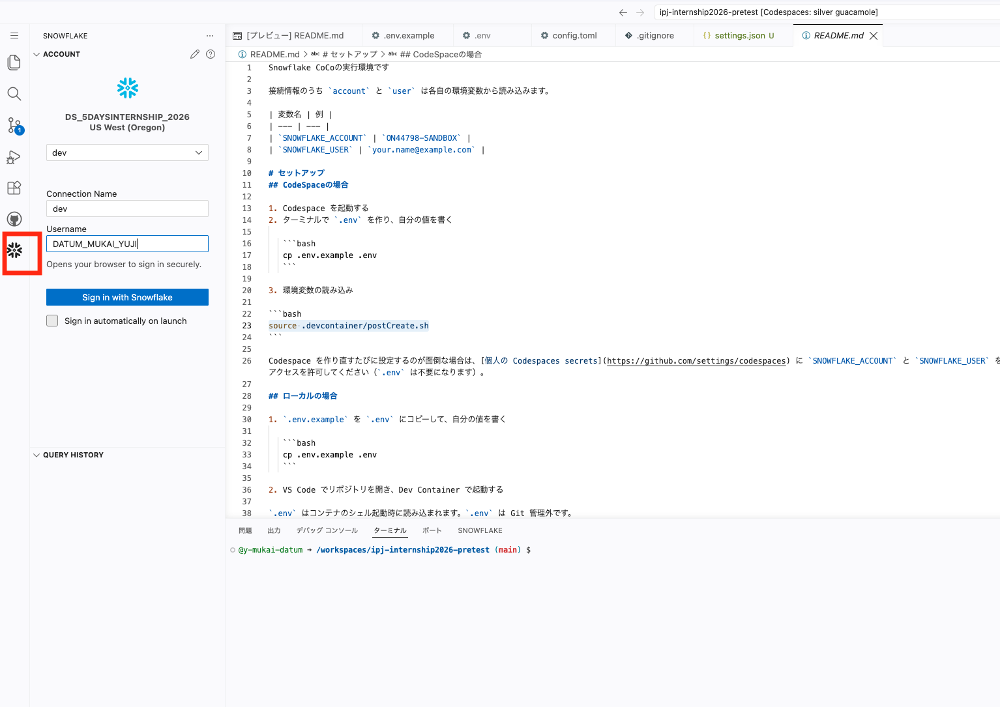
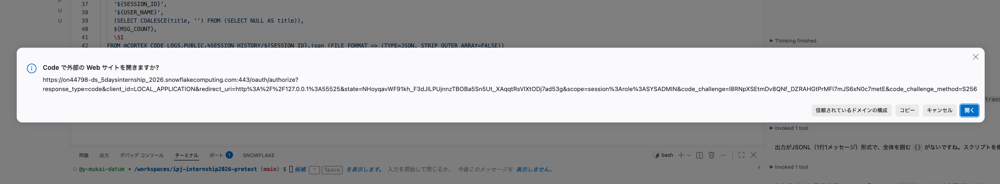
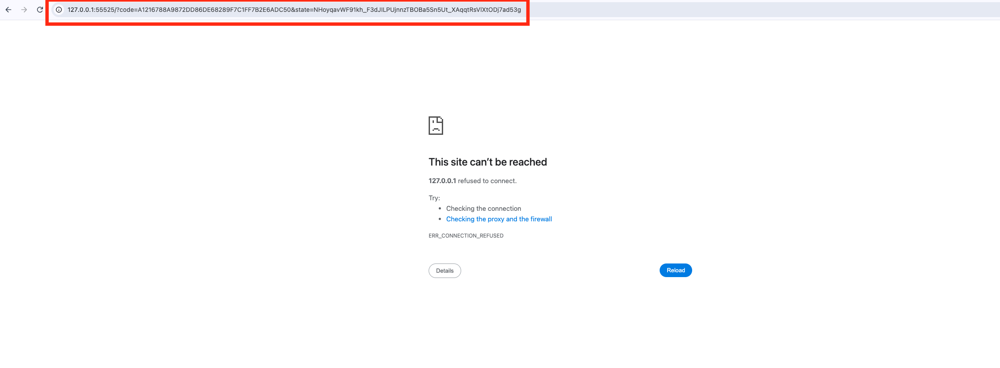
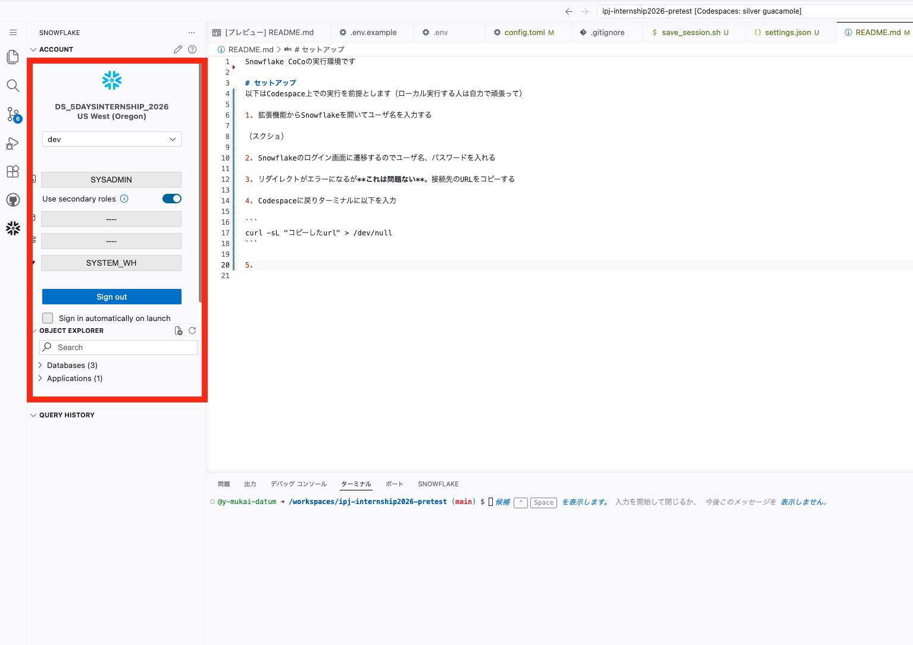

Snowflake CoCoの実行環境です

# セットアップ
以下はCodespace上での実行を前提とします（ローカル実行する人は自力で頑張って）

0. config.toml.exampleをコピーしてconfig.tomlを作成し、YOUR_USERNAMEを自身のSnowflakeユーザ名に書きかえる。

```
cp .snowflake/config.toml.example .snowflake/config.toml
```

1. 拡張機能からSnowflakeを開いてユーザ名を入力する



2. Snowflakeのログイン画面に遷移するのでユーザ名、パスワードを入れる




3. リダイレクトがエラーになるが**これは問題ない**。接続先のURLをコピーする



4. Codespaceに戻りターミナルに以下を入力

```
curl -sL "コピーしたurl" > /dev/null
```

5. アカウント名が表示されればOK


